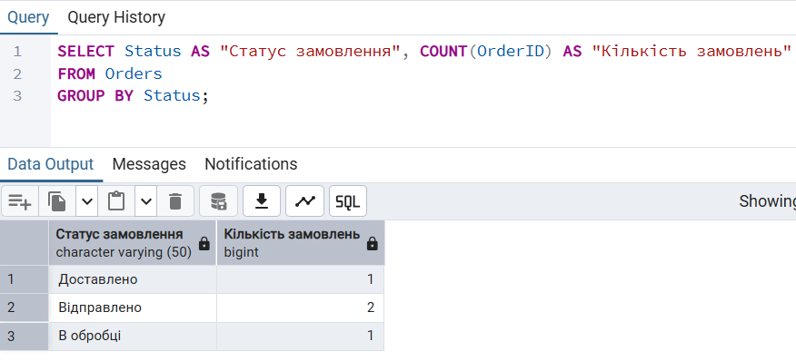
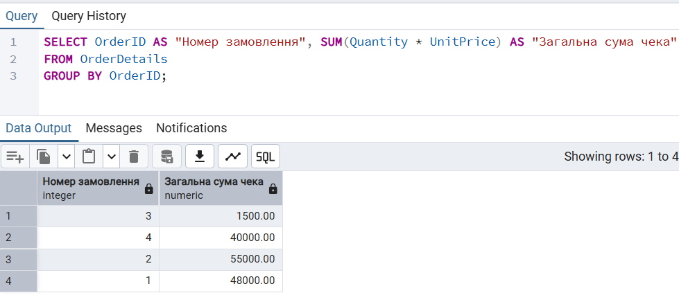
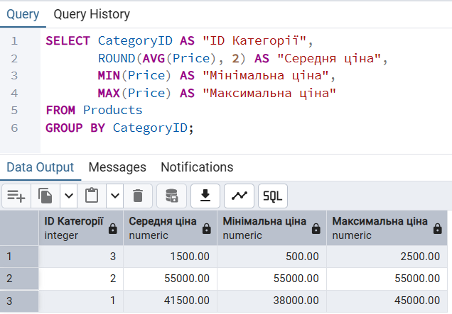
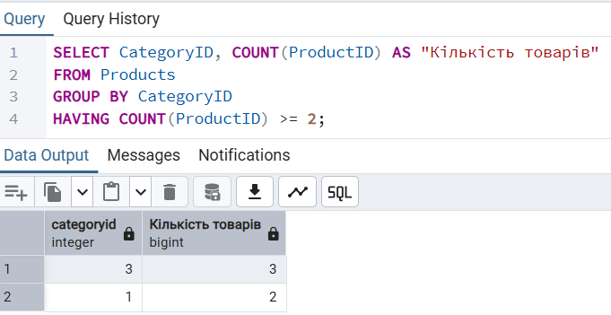
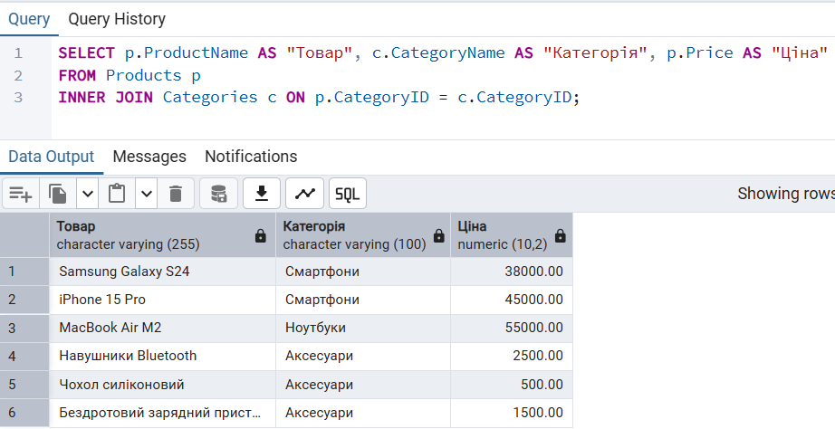
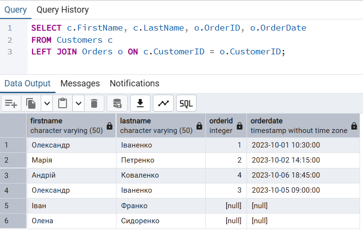
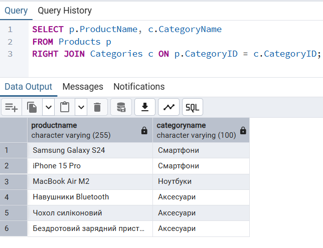
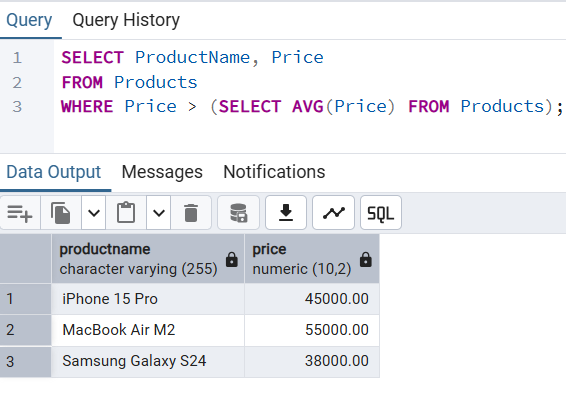
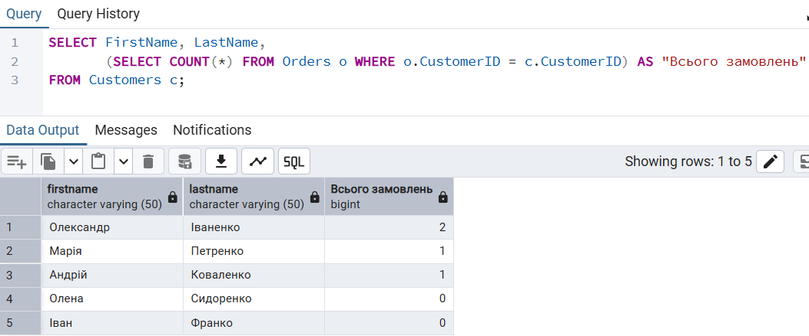
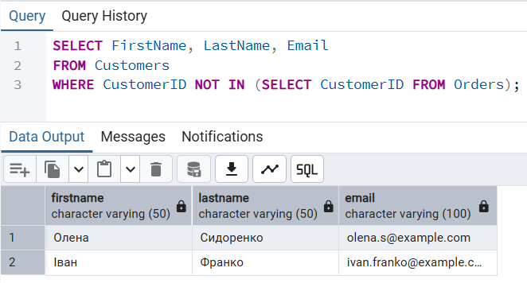

# Лабораторна робота №4 | Аналітичні SQL-запити (OLAP)

### Мета роботи
Написання аналітичних SQL-запитів для існуючої схеми бази даних Бібліотеки. Використання агрегатних функцій, об'єднань (JOIN) та підзапитів для підсумовування тенденцій та створення звітів.

---

### Блок 1: Базова агрегація та групування даних

Написано 4 запити з використанням агрегатних функцій (`COUNT`, `MIN`, `MAX`, `SUM`, `AVG`) та групування (`GROUP BY` , `HAVING`):

* Підрахунок кількості замовлень за їхнім статусом
* Розрахунок загальної суми кожного чека
* Статистика цін товарів по категоріях
* Фільтрація згрупованих даних

**Результат роботи фільтрації (HAVING):**

---

### Блок 2: Запити JOIN

Написано 3 запити для об'єднання даних з кількох таблиць:

* **INNER JOIN:** Отримання товарів разом із назвами їхніх категорій
* **LEFT JOIN:** Список усіх клієнтів та їхніх замовлень, навіть якщо замовлень ще немає
* **RIGHT JOIN:** Усі категорії та товари в них 

**Результат об'єднання трьох таблиць:**

---

### Блок 3: Підзапити

Написано 3 запити з використанням вкладених конструкцій:

* **Підзапит у WHERE:** Пошук товарів, які дорожчі за середню ціну по магазину
* **Підзапит у SELECT:** Виведення списку клієнтів разом із загальною кількістю їхніх замовлень
* **Підзапит у WHERE з NOT IN:** Пошук клієнтів, які ще нічого не купили 

**Результат підзапиту в SELECT (підрахунок книг):**

