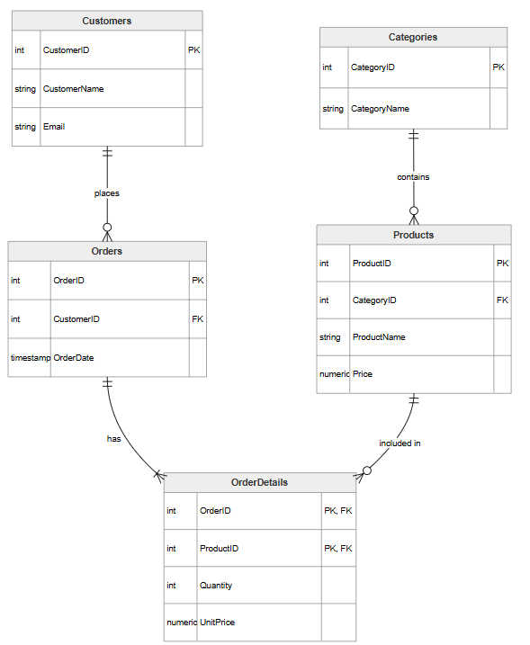

# Лабораторна робота №5 | Нормалізація бази даних

## 1. Початкова схема (Ненормалізована форма - UNF)
Початкова ненормалізована таблиця містить усі дані в одному місці:
**Raw_Orders** (`OrderID`, `OrderDate`, `CustomerID`, `CustomerName`, `Email`, `ProductID`, `ProductName`, `CategoryName`, `Quantity`, `UnitPrice`)

**У цій структурі виникають наступні аномалії:**

**Надлишковість:** Дані клієнта (Ім'я, Email) та товару (Назва, Категорія) дублюються в кожному рядку, якщо клієнт купує кілька товарів або робить кілька замовлень.

**Аномалія оновлення:** Якщо зміниться назва категорії (наприклад, з «Мобільні» на «Смартфони»), доведеться оновлювати тисячі рядків із продажами цих товарів.

**Аномалія вставки:** Ми не можемо додати нового клієнта в базу або новий товар у каталог, поки не буде оформлено хоча б одне замовлення (оскільки OrderID буде порожнім).

**Аномалія видалення:** Якщо клієнт скасовує своє єдине замовлення і ми видаляємо цей рядок, ми назавжди втрачаємо дані про самого клієнта та інформацію про товар.

## 2. Функціональні залежності (ФЗ)
Для таблиці `Raw_Orders` складеним первинним ключем є комбінація (`OrderID`, `ProductID`)

**ФЗ 1 (Повна залежність):** (OrderID, ProductID) -> Quantity, UnitPrice

**ФЗ 2 (Часткова залежність від OrderID):** OrderID -> OrderDate, CustomerID, CustomerName, Email

**ФЗ 3 (Часткова залежність від ProductID):** ProductID -> ProductName, CategoryName

**ФЗ 4 (Транзитивна залежність):** CustomerID -> CustomerName, Email

## 3. Етапи нормалізації

**Перехід до 1НФ (Атомарність):**

Таблиця вже знаходиться в 1НФ, оскільки кожна клітинка містить лише одне атомарне значення (немає масивів чи списків через кому), а кожен рядок унікально ідентифікується складеним ключем (`OrderID`, `ProductID`).

**Перехід до 2НФ (Усунення часткових залежностей):**

Згідно з правилами 2НФ, жоден неключовий атрибут не повинен залежати лише від частини складеного ключа. Ми розбиваємо `Raw_Orders` на три таблиці:

**OrderDetails** (`OrderID`, `ProductID`, `Quantity`, `UnitPrice`) — залишаються атрибути, що залежать від усього ключа (ФЗ 1).

**Temp_Orders** (`OrderID`, `OrderDate`, `CustomerID`, `CustomerName`, `Email`) — атрибути, що залежать лише від OrderID (ФЗ 2).

**Temp_Products** (`ProductID`, `ProductName`, `CategoryName`) — атрибути, що залежать лише від ProductID (ФЗ 3).

**Перехід до 3НФ (Усунення транзитивних залежностей):**

Згідно з правилами 3НФ, неключові атрибути не можуть залежати від інших неключових атрибутів.

**У таблиці `Temp_Orders`** ім'я та email залежать від CustomerID (який не є первинним ключем). Тому ми виносимо їх у таблицю `Customers`.

**У таблиці `Temp_Products`** неявно присутня категорія. Щоб уникнути дублювання назв категорій, виносимо їх у довідник `Categories`.

**Остаточний дизайн у 3НФ:** `Customers`, `Categories`, `Products`, `Orders`, `OrderDetails`.

## 4. Команди для переходу до нормалізованої схеми (ALTER TABLE)

```-- 1. Створення нормалізованих таблиць (3НФ)
CREATE TABLE Customers (
    CustomerID SERIAL PRIMARY KEY,
    CustomerName VARCHAR(100) NOT NULL,
    Email VARCHAR(100) UNIQUE NOT NULL
);

CREATE TABLE Categories (
    CategoryID SERIAL PRIMARY KEY,
    CategoryName VARCHAR(100) UNIQUE NOT NULL
);

CREATE TABLE Products (
    ProductID SERIAL PRIMARY KEY,
    CategoryID INTEGER REFERENCES Categories(CategoryID),
    ProductName VARCHAR(255) NOT NULL,
    Price NUMERIC(10, 2) NOT NULL
);

CREATE TABLE Orders (
    OrderID SERIAL PRIMARY KEY,
    CustomerID INTEGER REFERENCES Customers(CustomerID),
    OrderDate TIMESTAMP DEFAULT CURRENT_TIMESTAMP
);

CREATE TABLE OrderDetails (
    OrderID INTEGER REFERENCES Orders(OrderID),
    ProductID INTEGER REFERENCES Products(ProductID),
    Quantity INTEGER NOT NULL,
    UnitPrice NUMERIC(10, 2) NOT NULL,
    PRIMARY KEY (OrderID, ProductID)
);

-- 2. Видалення початкової ненормалізованої таблиці
DROP TABLE IF EXISTS Raw_Orders;
```

## 5. Оновлена діаграма ER

Нижче наведено діаграму, яка відображає нормалізовану структуру бази даних з усіма атрибутами та зв'язками.


