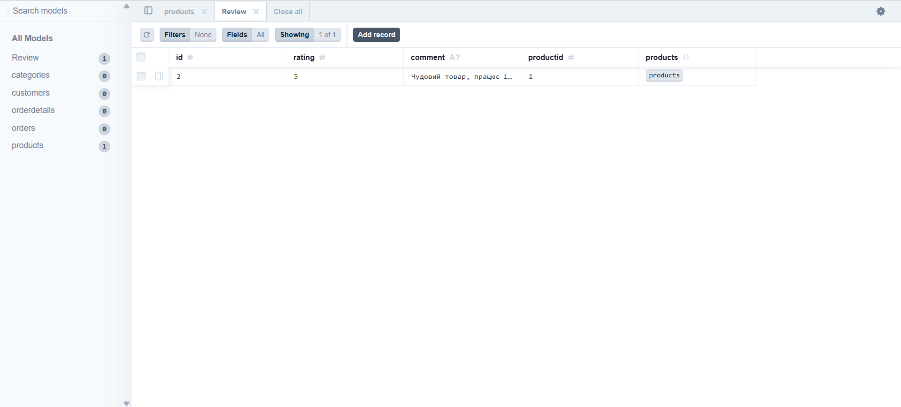

# Міграції


## 1. Додавання нової таблиці (Review)

**Опис:** Додано нову сутність `Review` для зберігання відгуків клієнтів про товари. Вона має зв'язок "багато до одного" з таблицею `Products`.

**Зміни в `schema.prisma`:**

```prisma
model Review {
  id        Int      @id @default(autoincrement())
  rating    Int
  comment   String?
  productId Int
  product   Products @relation(fields: [productId], references: [ProductID])
}
// ОНОВЛЕННЯ ІСНУЮЧОЇ МОДЕЛІ
model Products {
  // ...
  reviews       Review[]  // Зворотній зв'язок
}
```

---

## 2. Зміна існуючих таблиць

**Опис:** До таблиці `Products` додано логічний прапорець `isAvailable`, який вказує, чи доступний товар для замовлення, зі значенням за замовчуванням `true`.

**Зміни в `schema.prisma`:**

### Модель `Products`

**До:**
```prisma
model Products {
  ProductID     Int            @id @default(autoincrement())
  ProductName   String         @db.VarChar(255)
  Price         Decimal        @db.Decimal(10, 2)
  StockQuantity Int            @default(0)
}
```

**Після:**
```prisma
model Products {
  ProductID     Int            @id @default(autoincrement())
  ProductName   String         @db.VarChar(255)
  Price         Decimal        @db.Decimal(10, 2)
  StockQuantity Int            @default(0)
  isAvailable   Boolean        @default(true) // Нове поле
}
```

Зміна реалізована через Prisma migrate dev, що автоматично створює SQL ALTER TABLE.

---

## 3. Видалення стовпця

**Опис:** Видалено поле `Phone` з таблиці `Customers`, оскільки для авторизації та зв'язку тепер використовується виключно `Email`.

**Зміни в `schema.prisma`:**

**До:**
```prisma
model Customers {
  CustomerID Int      @id @default(autoincrement())
  FirstName  String   @db.VarChar(50)
  LastName   String   @db.VarChar(50)
  Email      String   @unique @db.VarChar(100)
  Phone      String?  @db.VarChar(20) // Поле, що видаляється
}
```

**Після:**
```prisma
model Customers {
  CustomerID Int      @id @default(autoincrement())
  FirstName  String   @db.VarChar(50)
  LastName   String   @db.VarChar(50)
  Email      String   @unique @db.VarChar(100)
}
```

---

## 4. Перевірка роботи схеми

Для перевірки коректності змін у базі даних було написано скрипт на Node.js, який підключається до бази даних PostgreSQL, створює тестові дані та зчитує їх.

**Результат виконання тесту:**
```
Очищення старих тестових відгуків...
Додавання нового відгуку до товару з ID: 1...
Відгук створено успішно!

Отримання результату з бази (Товар + Відгуки):
{
  "productid": 1,
  "categoryid": null,
  "productname": "Тестовий Смартфон",
  "price": "15000",
  "stockquantity": 5,
  "isAvailable": true,
  "reviews": [
    {
      "id": 2,
      "rating": 5,
      "comment": "Чудовий товар, працює ідеально!",
      "productid": 1
    }
  ]
}
```


### Скріншот з Prisma Studio


Цей тест підтверджує, що:
1. Таблиця `review` успішно створена в базі даних.
2. Зв'язки між `review` та `product` працюють коректно.
3. Операції запису та читання виконуються без помилок.
